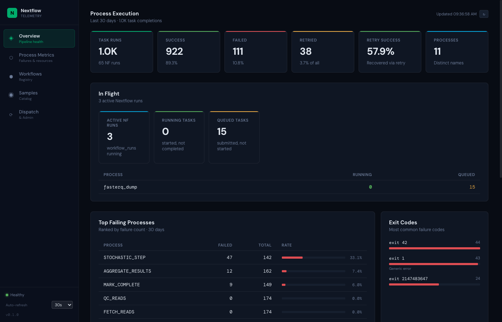

# Nextflow Telemetry

A dispatch and telemetry server for the curatedMetagenomics Nextflow pipeline. It ingests
real-time execution events from Nextflow, tracks sample-level processing outcomes, and
presents the results through a live React dashboard.



---

## Dashboard

The dashboard is the primary interface for the cMGD team to monitor pipeline progress and
diagnose problems. It auto-refreshes every 30 seconds (configurable).

### Overview

The landing page gives a pipeline health summary for the last 30 days:

- **KPI cards** — total task runs, success rate, failure count, retry rate, and retry
  recovery rate across all Nextflow processes
- **In Flight** — live counts of tasks currently executing or queued in SLURM, broken down
  by process name. Updates each poll cycle so you can watch a batch progress in real time.
- **Top Failing Processes** — processes ranked by absolute failure count, with bar-chart
  failure rates. The most actionable view for triage.
- **Exit Codes** — frequency chart of the most common failure exit codes (e.g. 137 = OOM
  kill, 1 = generic error) to identify systemic resource or configuration problems.
- **Event Mix** — donut chart of raw Nextflow weblog event types (process_submitted,
  process_started, process_completed, etc.) — useful for spotting stalls.
- **Most Retried Processes** — processes that most often fail and get retried, with counts
  of how many retries ultimately recovered vs. exhausted all attempts.

### Process Metrics

Detailed task-level analytics with four tabs:

| Tab | What it shows |
|-----|--------------|
| **Failures** | Every process ranked by failure rate, with success/failure counts and most common exit code |
| **Retries** | Retry breakdown by attempt number and by process — how often does a second try succeed? |
| **Resources** | CPU and memory utilisation (average and P95) vs. what was requested, plus disk I/O |
| **Signatures** | Heatmap of (process × exit code) combinations — reveals whether a failure mode is process-specific or global |

### Workflows

Registry of pipeline versions. Each workflow card shows:

- Status (active / paused / retired) with colour coding
- A progress bar of jobs across the full sample queue: pending → running → completed / failed / dead-letter
- Configuration detail (repository, revision, profile, max retries) on expand

### Samples

Paginated catalog of all registered BioSample IDs with metadata and full-text search.

---

## Key Concepts

**Sample** — a BioSample ID (e.g. `SAMN01234567`) plus associated NCBI accessions and
metadata. Each sample is processed once per active workflow version.

**Job** — one processing attempt for a (sample, workflow version) pair. Lifecycle:
`pending → claimed → running → completed | failed`. A job can be retried up to
`max_retries` times before being written to the dead-letter table.

**Workflow run** — a single Nextflow execution that processes a batch of samples together.
The server dispatches runs in configurable batch sizes.

**Process metrics** — task-level data from individual Nextflow process executions
(`FETCH_READS`, `PROFILE_TAXA`, etc.). A sample's job can succeed even if some tasks failed
and were rescued by retry. Process metrics and job outcomes are complementary views.

**MARK\_COMPLETE** — the pipeline's completion sentinel. When the `MARK_COMPLETE` process
fires successfully for a sample, that sample's job is marked `completed`. If a run ends
without it, the job is failed (or re-queued if retries remain).

---

## Architecture

```
                        ┌─────────────────────────────────┐
                        │          Alpine HPC              │
                        │                                  │
  ┌──────────────┐      │  ┌───────────┐  SLURM submit    │
  │  nf-client   │──────┼─►│ sbatch    │──────────────►   │
  │  (daemon on  │      │  │ wrapper   │                   │
  │  head node)  │◄─────┼──│ job       │◄── Nextflow       │
  └──────┬───────┘      │  └───────────┘    per-sample     │
         │              │        │          tasks           │
         │ claim/report │        │ -with-weblog             │
         ▼              └────────┼────────────────────────-─┘
  ┌──────────────────────────────▼──────────────────┐
  │              FastAPI server + PostgreSQL          │
  │                                                  │
  │  /telemetry  ◄── Nextflow weblog events          │
  │  /dispatch   ◄── nf-client claims & reports      │
  │  /metrics    ──► dashboard queries               │
  │  /samples    ──► sample catalog                  │
  └──────────────────────────┬───────────────────────┘
                             │
                      ┌──────▼──────┐
                      │  React UI   │
                      │  dashboard  │
                      └─────────────┘
```

**Data flow**

1. Samples are registered in the server's catalog (BioSample IDs + NCBI accessions).
2. `nf-client` (running as a daemon on the Alpine head node) claims batches of pending
   samples from the server and submits a SLURM wrapper job for each batch.
3. The wrapper job runs Nextflow, which submits individual compute tasks (downloading reads,
   taxonomic profiling, etc.) back to SLURM via the `process.executor = 'slurm'` setting.
4. Nextflow sends real-time weblog events to the server's `/telemetry` endpoint as each
   task starts and finishes.
5. When the `MARK_COMPLETE` sentinel process fires for a sample, the server marks that
   sample's job as `completed`. If the run ends without it, the job is swept to `failed`.
6. The dashboard polls the server's metrics and status endpoints to render live progress.

**Storage** — all data lives in PostgreSQL. Raw Nextflow events are stored as JSONB in the
`telemetry` table; sample, workflow, and job state live in their own relational tables.
Process-level metrics are computed at query time from the raw event stream.

---

## Development

### Prerequisites

- Python 3.11+ with [uv](https://docs.astral.sh/uv/)
- Node 18+ with npm
- PostgreSQL (or use the Docker Compose stack)
- [just](https://github.com/casey/just) command runner

### Quick start

```bash
uv sync --group dev      # install Python dependencies
just up-db               # start PostgreSQL via Docker Compose
just migrate             # run Alembic migrations
just run                 # start the API server (hot reload)

cd frontend && npm install && npm run dev   # frontend dev server
```

### Common commands

```bash
just help       # list all commands
just check      # typecheck + tests
just ci         # full CI gate (sync --frozen + mypy + pytest)
just seed       # seed sample catalog from ArtachoA_2021_sample.tsv
```

### API reference

Interactive OpenAPI docs are available at `/docs` when the server is running.

| Group | Endpoints |
|-------|-----------|
| Telemetry ingest | `POST /telemetry` |
| Dispatch | `POST /dispatch/batch`, `/dispatch/submitted`, `/dispatch/requeue-expired` |
| Samples | `GET/POST /samples`, `GET /samples/{id}` |
| Workflows | `GET/POST /workflows`, `PATCH /workflows/{pk}/status`, `GET /workflows/{pk}/job-summary` |
| Process metrics | `GET /metrics/processes/running`, `/summary`, `/failures`, `/retries`, `/resources-by-attempt`, `/failure-signatures` |
| Admin | `POST /admin/reconcile-jobs` |

### nf-client (HPC orchestration)

The `nf-client` CLI dispatches Nextflow runs against the server's job queue. It is only
needed by whoever operates the HPC submission daemon — not by dashboard consumers.

```bash
uv pip install -e packages/nf_client
nf-client daemon --config client-alpine.yaml
```

For full Alpine SLURM deployment details see [docs/hpc-deployment.md](docs/hpc-deployment.md).

### Test pipeline

`nf_testing/main.nf` is a stub metagenomics pipeline (no real tools required) that
exercises the full telemetry contract. `v0.2.0` includes a `STOCHASTIC_STEP` that fails
with configurable probability (default 30%) to generate realistic retry telemetry.
