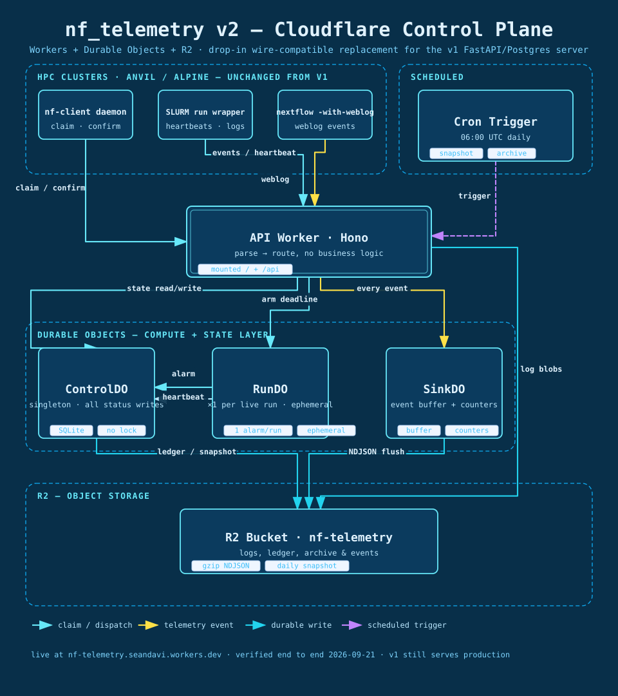
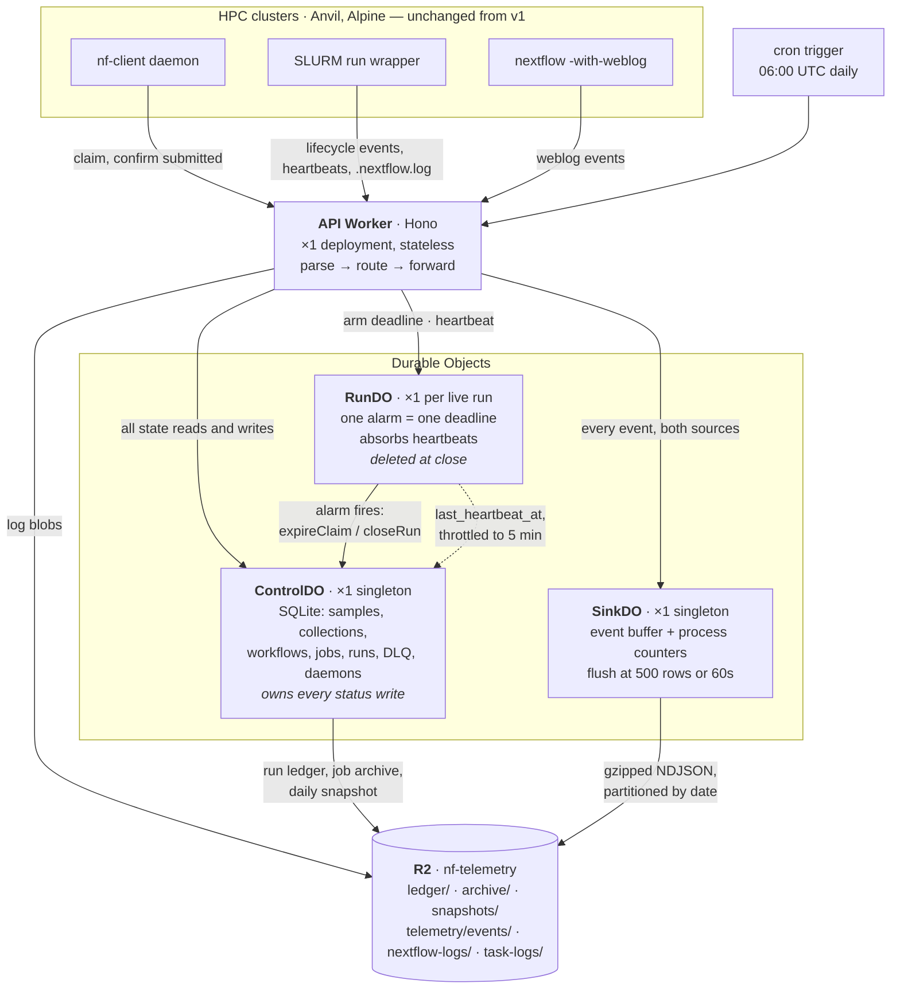
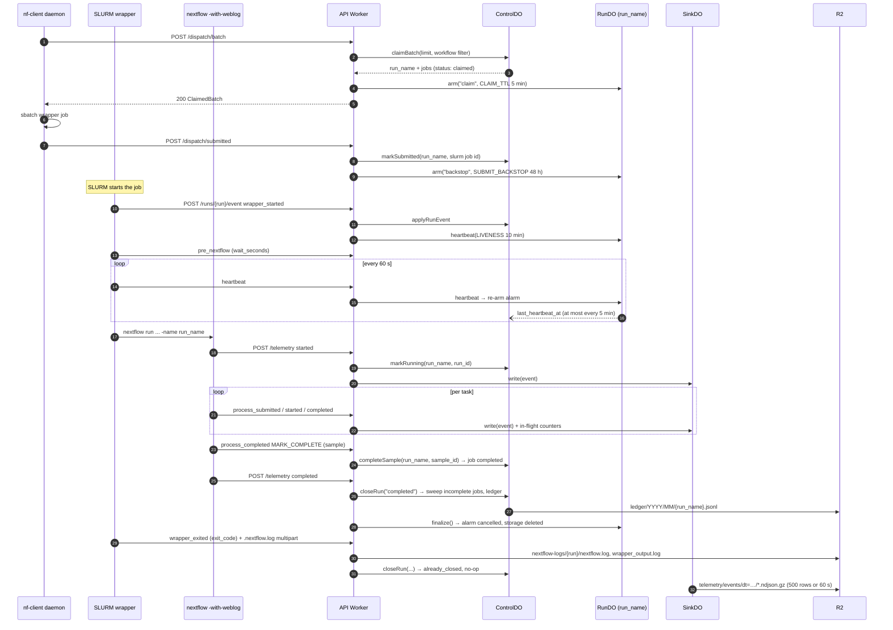
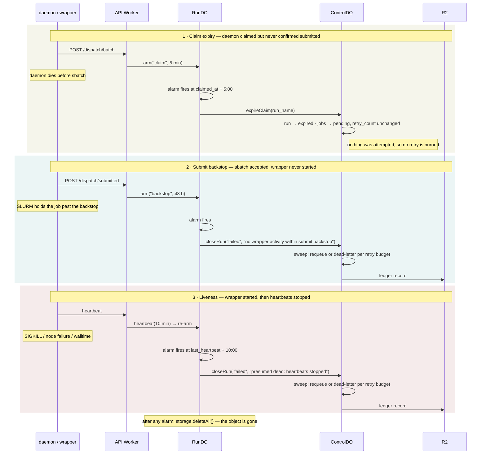
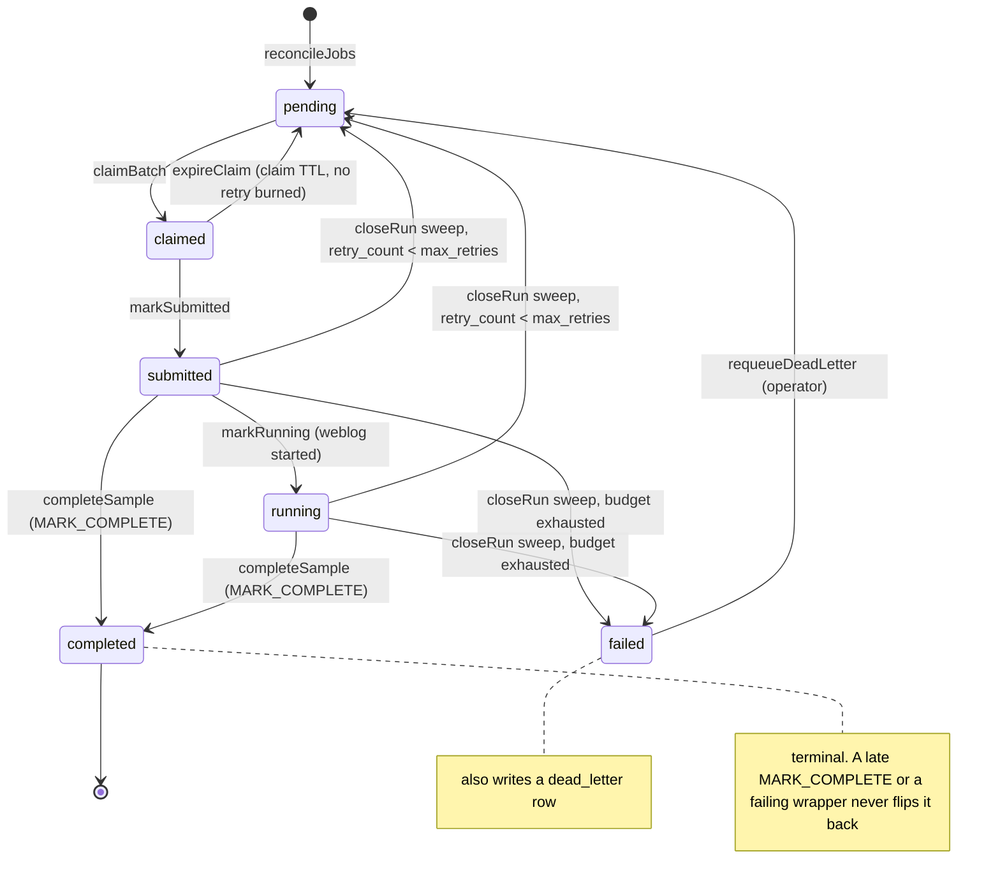

# nf_telemetry v2 — data model, object topology, and lifecycles

Four views of `cf/`: what ControlDO stores, how the three Durable Object classes relate,
what one run looks like end to end, and how the three timers close a run nobody reports on.
Diagrams are Mermaid and render on GitHub. For slides, the same topology as a validated
standalone image, [`architecture.svg`](architecture.svg):



---

## ControlDO — SQLite schema

One Durable Object holds the entire relational control plane. This is the v1 Postgres
schema minus the tables that only existed because Postgres was also the analytics store:
`telemetry` and `task_executions` are now NDJSON on R2, and `task_logs` are R2 objects.


**Reading notes**

- **No foreign keys are declared.** SQLite would enforce them, but every write already
  goes through one module in one single-threaded object, and FK enforcement would turn
  the retired-version job purge into a cascade problem. The relationships above are real
  and maintained in code; they are not constraints.
- `jobs` carries `workflow_id` and `workflow_version` alongside `workflow_pk`. That
  denormalisation is deliberate: the claim query orders by `(workflow_id,
  workflow_version, created_at)` and must not join to do it.
- `job_counts` is derived state, written **only** by the three triggers on `jobs`. It
  exists so job-summary is a 6-row read instead of a 100k-row scan.
- `daemons` stands alone — it describes the fleet, not the work.
- `jobs` is the only table that grows as `samples × versions`; retired versions are
  archived to R2 and purged, which bounds it at `samples × active versions`.

---

## Object topology



| Object | Count | Lifetime | Why it is its own object |
|---|---|---|---|
| **ControlDO** | 1 | forever | Single-threaded + synchronous SQL means claims are atomic with no locking, and everything stays joinable in one query. |
| **RunDO** | 1 per live run | claim → close | A Durable Object has exactly one alarm, so per-run deadlines need per-run objects. It also keeps heartbeats — the highest-frequency write — off the object every claim serializes on. |
| **SinkDO** | 1 | forever | Buffers writes so events land on R2 in batches rather than one object per event, and it is already the one place that sees every process event, so it owns the in-flight counters. |

**Reading notes**

- The dashed edge is the only *optional* write: RunDO pushes `last_heartbeat_at` upstream
  at most once every 5 minutes. A heartbeat that arrives between pushes touches nothing
  but RunDO's own alarm.
- RunDO never writes terminal state. When its alarm fires it calls ControlDO, which no-ops
  if the run already closed — so the weblog, the timer, and an operator all converge on
  one close path.
- Nothing here is a cron sweeper. The daily trigger takes a snapshot and reclaims retired
  jobs; claim expiry and heartbeat death are RunDO alarms, which is what let the v1
  `requeue-expired`, `expire-stale-runs` and `heartbeat-watchdog` endpoints become no-ops.

---

## One run, happy path

Every arrow into the Worker is a v1 path. The daemon and the weblog are the only callers
that need to know the server exists; the wrapper is best-effort and can never fail a run.



**Reading notes**

- Steps 3, 8 and 13 are the three phases a RunDO can be in. Each `arm`/`heartbeat`
  replaces the previous alarm; a RunDO has exactly one.
- The run is closed at step 25 by the weblog, not at step 29 by the wrapper. `closeRun`
  is idempotent, so whichever terminal signal lands first wins and the rest are no-ops.
  This is why `wrapper_exited` with a non-zero code cannot un-complete a run that
  Nextflow already reported as completed.
- `MARK_COMPLETE` (step 22) completes the job the moment it lands. Jobs still not
  completed when the run closes are swept: `retry_count < max_retries` → back to
  `pending` with `retry_count + 1`; otherwise `failed` plus a `dead_letter` row.
- Only step 1, 6 and the operator routes need the bearer token. `/telemetry` and
  `/runs/{run}/event` are open because neither the weblog reporter nor the wrapper can
  carry one (`authExempt` in `index.ts`).

---

## The three timers

What happens when the happy path stops. Each is a RunDO alarm; none is a sweeper.
Verified on the deployed worker 2026-09-21 with a real clock (see `cf/README.md`).



| Timer | Armed by | Fires after | Terminal state | Retry burned? |
|---|---|---|---|---|
| claim | `POST /dispatch/batch` | `CLAIM_TTL_MINUTES` (5) | run `expired`, jobs `pending` | no |
| backstop | `POST /dispatch/submitted` | `SUBMIT_BACKSTOP_HOURS` (48) | run `failed`, jobs swept | yes |
| liveness | `wrapper_started`, every `heartbeat` | `LIVENESS_MINUTES` (10) | run `failed`, jobs swept | yes |

All three are cancelled by `finalize()`, which every terminal path calls: weblog
`completed`, `wrapper_exited`, `POST /admin/close-run`, and `POST /admin/reset`.

---

## State machines

Every transition below is one ControlDO method, and the `job_counts` triggers fire on
each. There are no other writers. Both machines are the v1 ones; only the owner changed.

### Job



### Run

```mermaid
stateDiagram-v2
    [*] --> claimed : claimBatch (mints run_name, arms claim timer)
    claimed --> expired : expireClaim (claim alarm)
    claimed --> submitted : markSubmitted (arms backstop)
    submitted --> running : markRunning (weblog started)
    submitted --> completed : closeRun "completed"
    running --> completed : closeRun "completed"
    submitted --> failed : closeRun "failed"
    running --> failed : closeRun "failed"
    expired --> [*]
    completed --> [*]
    failed --> [*]
    note right of completed : callers of closeRun: weblog completed, wrapper_exited 0, admin close-run
    note right of failed : callers of closeRun: wrapper_exited non-zero, backstop alarm, liveness alarm, admin close-run
```

**Reading notes**

- A run's `status` and a job's `status` are independent columns. A run can be
  `completed` while its job is `failed`: Nextflow finished, but `MARK_COMPLETE` never
  fired for that sample, so the sweep failed it. `fail-mark` in `nf_testing` produces
  exactly this.
- `closeRun` on an already-terminal run returns `already_closed: true` and changes
  nothing. That guard is what makes the four callers of each terminal state safe to
  race.
- `expired` is the only run state that costs the jobs nothing. Everything else that
  ends a run without `MARK_COMPLETE` spends one unit of the retry budget.
