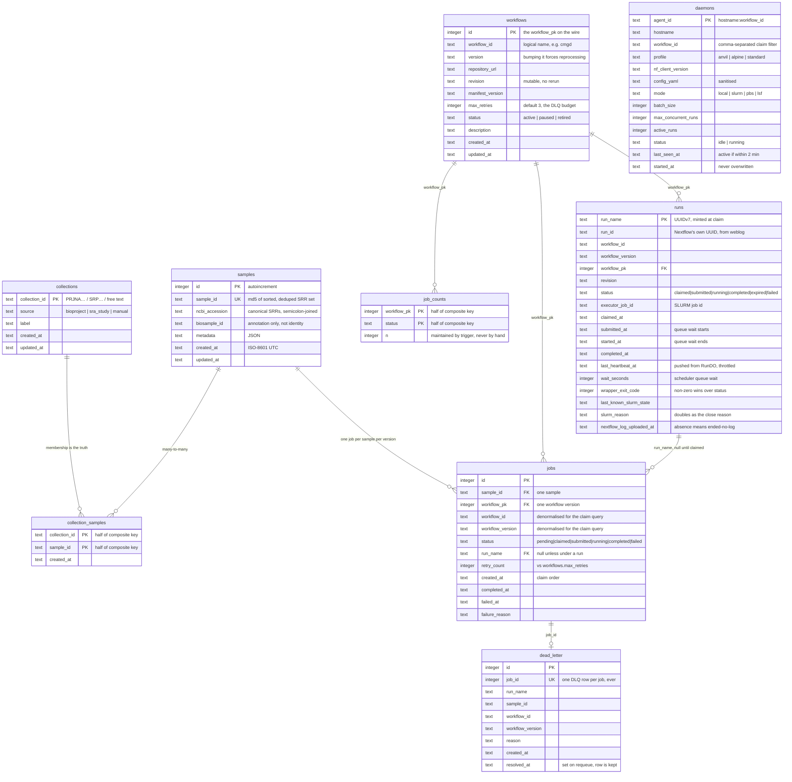
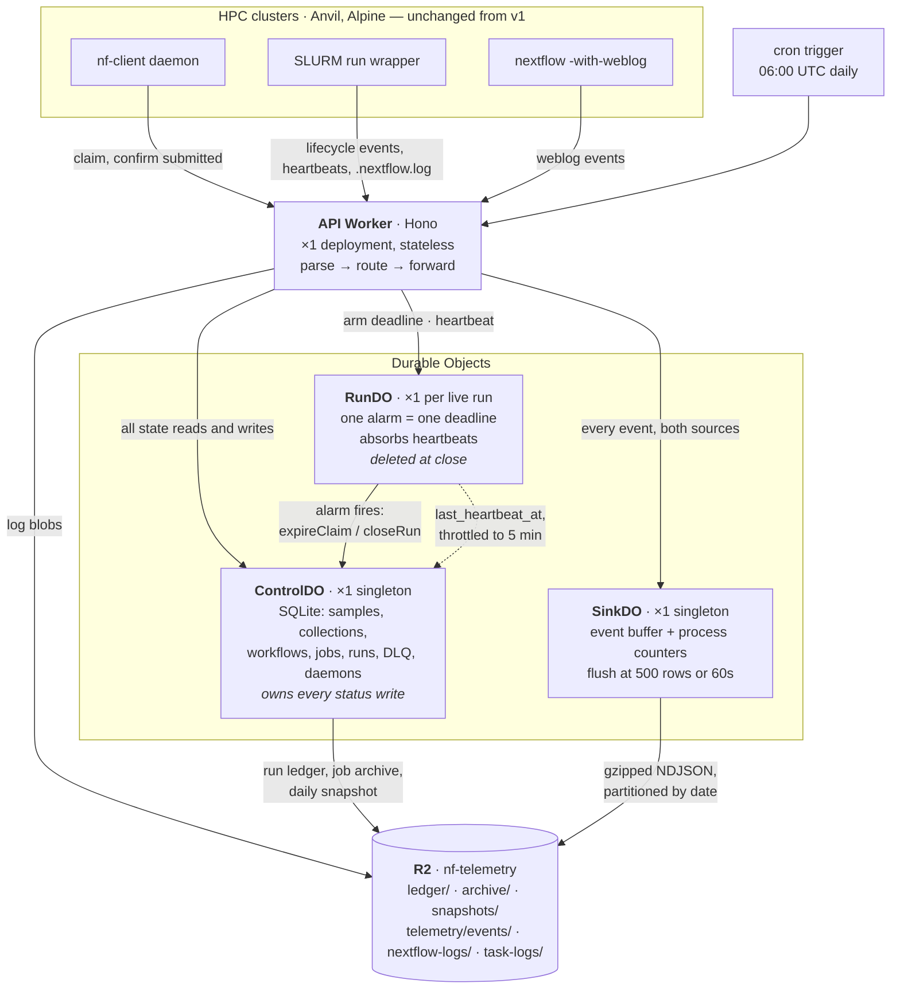

# nf_telemetry v2 — data model and object topology

Two views of `cf/`: what ControlDO stores, and how the three Durable Object classes relate.

---

## ControlDO — SQLite schema

One Durable Object holds the entire relational control plane. This is the v1 Postgres
schema minus the tables that only existed because Postgres was also the analytics store:
`telemetry` and `task_executions` are now NDJSON on R2, and `task_logs` are R2 objects.

**Reading notes**

- **No foreign keys are declared.** SQLite would enforce them, but every write already
  goes through one module in one single-threaded object, and FK enforcement would turn
  the retired-version job purge into a cascade problem. The relationships above are real
  and maintained in code; they are not constraints.
- `jobs` carries `workflow_id` and `workflow_version` alongside `workflow_pk`. That
  denormalisation is deliberate: the claim query orders by `(workflow_id,
  workflow_version, created_at)` and must not join to do it.
- `job_counts` is derived state, written **only** by the three triggers on `jobs`. It
  exists so job-summary is a 6-row read instead of a 100k-row scan.
- `daemons` stands alone — it describes the fleet, not the work.
- `jobs` is the only table that grows as `samples × versions`; retired versions are
  archived to R2 and purged, which bounds it at `samples × active versions`.

---

## Object topology

| Object | Count | Lifetime | Why it is its own object |
|---|---|---|---|
| **ControlDO** | 1 | forever | Single-threaded + synchronous SQL means claims are atomic with no locking, and everything stays joinable in one query. |
| **RunDO** | 1 per live run | claim → close | A Durable Object has exactly one alarm, so per-run deadlines need per-run objects. It also keeps heartbeats — the highest-frequency write — off the object every claim serializes on. |
| **SinkDO** | 1 | forever | Buffers writes so events land on R2 in batches rather than one object per event, and it is already the one place that sees every process event, so it owns the in-flight counters. |

**Reading notes**

- The dashed edge is the only *optional* write: RunDO pushes `last_heartbeat_at` upstream
  at most once every 5 minutes. A heartbeat that arrives between pushes touches nothing
  but RunDO's own alarm.
- RunDO never writes terminal state. When its alarm fires it calls ControlDO, which no-ops
  if the run already closed — so the weblog, the timer, and an operator all converge on
  one close path.
- Nothing here is a cron sweeper. The daily trigger takes a snapshot and reclaims retired
  jobs; claim expiry and heartbeat death are RunDO alarms, which is what let the v1
  `requeue-expired`, `expire-stale-runs` and `heartbeat-watchdog` endpoints become no-ops.
